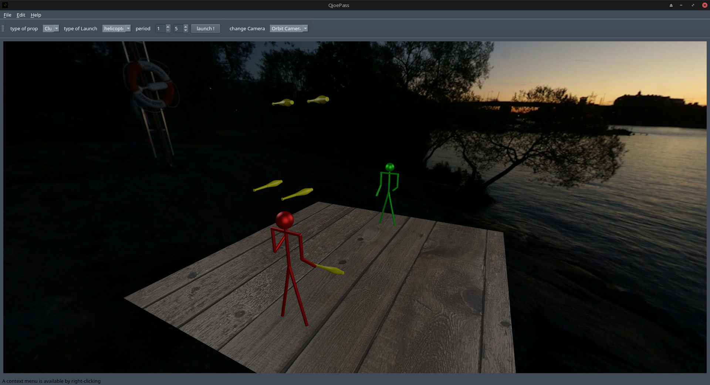

# Qjoepass

Qjoepass is a modern rewrite of joepass using c++ and Qt.

Poject is at an early stage of developpement.


# Screenshot



## Getting Started

These instructions will get you a copy of the project up and running on your local machine.

### Prerequisites

You need qt >= 5.14;
See [this link](https://www.qt.io/download) for more info

### Installing

Download source archive and untar or clone with git :

```
$ git clone https://github.com/skankerror/Qjoepass.git
```

Enter the directory and compile

```
$ cd Qjoepass
$ qmake Qjoepass.pro
$ make
```

Launch the app

```
$ ./Qjoepass
```

Have fun (or not)
This is a very alpha version.
You're warned.

## Built With

* [Qt](https://www.qt.io/)

## Contributing

Feel free to contribute (or not)

## Authors

* **Patrice Colet** - *Initial work* - [patricecolet](https://github.com/patricecolet)
* **Michaël Creusy** - *Initial work* - [skankerror](https://github.com/skankerror)

## License

This project is licensed under the GNU GPLv3 License - see the [LICENSE.md](LICENSE.md) file for details

## Acknowledgments

* Thanks Wolfgang Westerboer for [joepass project](http://koelnvention.de/w/?page_id=151).
